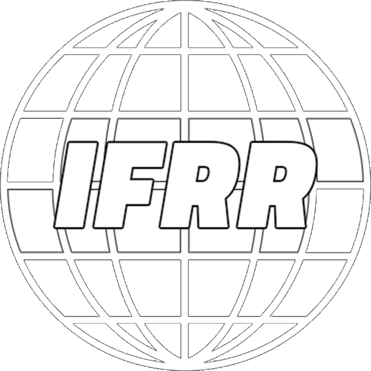

  

# International Federation of Roblox Racing
## About
The International Federation of Roblox Racing (IFRR) is a governing body for motorsport events in the Roblox platform. It is currently owned by Tran Dinh along with Dimers.

IFRR has 2 main divisions, Impulse 1 and Impulse X who are both inspired by the official FIA® Formula 1 and Formula E championships respectively.
